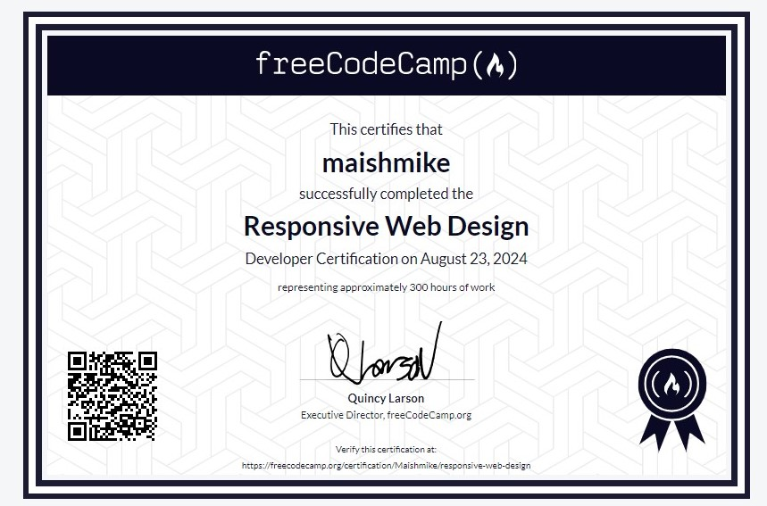

# Web Development and Design Journey
This journey covers my Web Development Journey

## Technologies applied

 

## Contents
- Web Development
- Web Design

## Achievements

### Web Design
* [x] 1) Course 1 
   * [x] - Basic HTML
   * [x] - Basic CSS
   * [x] - CSS Colors
   * [x] - HTML forms
* [x] 2) Course 2
   * [x] - CSS Box model
   * [x] - CSS flexbox
   * [x] - Typography
   * [x] - Accessibility
   
* [x] 3) Course 3
   * [x] - CSS Pseudo Selectors
   * [x] - Intermediate CSS
   * [x] - Responsive Design
   * [x] - Technical Documentation
   
* [x] 4) Course 4
   * [x] - CSS Variables
   * [x] - CSS Grid
   * [x] - Landing Page
   
* [x] 5) Course 5
   * [x] - CSS Animations
   * [x] - CSS Transforms
   * [x] - Portfolio

## Acknowledgments
* [FreeCodeCamp](https://www.freecodecamp.org/learn/2022/responsive-web-design/)
